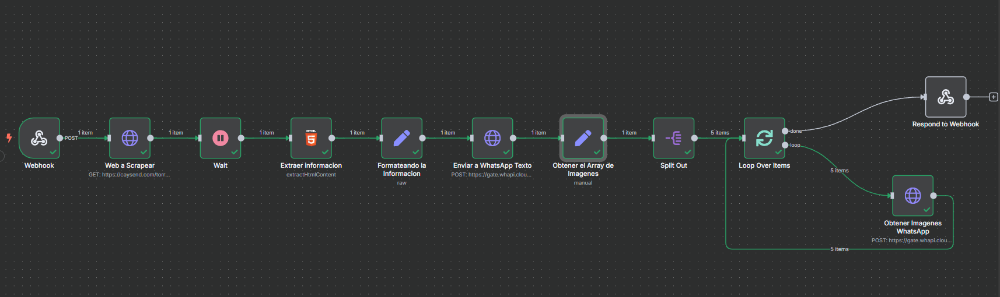

# Scrapping Test
Este proyecto es una prueba de concepto para realizar procesos automatizados de scraping utilizando n8n como herramienta de automatización. El flujo principal está basado en un Webhook que se activa mediante una petición POST desde un cliente web.

# Descripción
Este proyecto está diseñado para probar la integración de un proceso de scraping mediante un Webhook que, cuando se activa, ejecuta una serie de acciones automatizadas y envia los datos optenidos a tu WhatsApp. Se utiliza n8n para gestionar la automatización de tareas, como la recopilación de datos, y Docker para crear un entorno aislado y fácil de desplegar.

El flujo de trabajo se activa mediante una petición POST desde el cliente a un Webhook, que posteriormente realiza el scraping y responde con un mensaje indicando el estado de la ejecución.

# Tecnologías
n8n: Herramienta de automatización para crear flujos de trabajo.

Docker: Para contener y ejecutar el entorno de n8n.

JavaScript (Fetch API): Para interactuar con el Webhook desde el frontend.

HTML y CSS: Para la interfaz de usuario básica que activa el proceso de scraping.

# Instalación
- Requisitos previos
Tener Docker instalado.

Tener acceso a un entorno donde se pueda ejecutar n8n (se proporciona una configuración con Docker para facilitar la instalación).

API para el envio de mensajes por WhatsApp: https://whapi.cloud/

# Pasos
Clona este repositorio: https://github.com/Joacs49/Scrapping-test.git

En tu archivo config.js, asegúrate de que el cliente JavaScript esté configurado para interactuar con el Webhook:

window.config = {
    webhookUrl: "http://localhost:5678/webhook/scrapping"
};

# Configuración
- Webhook en n8n
Para que el flujo de trabajo funcione correctamente, configura el Webhook en el editor de n8n:

Crea un Webhook de tipo POST con la URL /scrapping.

Añade un nodo Respond to Webhook al final del flujo para responder con el texto "Respuesta Exitosa" o un mensaje personalizado, si la respuesta es exitosa se enviara la informacion obtenida via WhatsApp.

# Uso
Inicia el proceso de scraping haciendo clic en el botón en el frontend (con el código de JavaScript que se muestra arriba).

Verifica que la automatización se haya iniciado correctamente desde el mensaje en la interfaz de usuario.

# Flujo Utilizado en n8n

